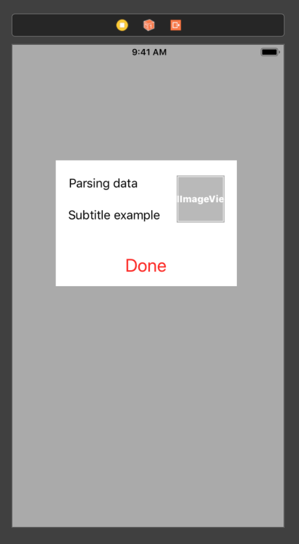

## Telas dinâmicas

Antes de mencionar o teste em si, é válido destacar o que chamamos de uma tela dinâmica, ou seja, uma tela construída a partir de informações provindas de um servidor. Isso significa que os dados fornecidos do backend possuem a liberdade de escolher itens como ordem, cor, conteúdo, cor e fonte dos textos, assim como o layout do visual que será apresentado ao usuário.

Optamos por essa abordagem em várias de nossas telas com o intuito de flexibilizar a maneira de exibição dessa tela, o que nos permite fazer experimentos e mudanças rápidas, por exemplo devido a uma decisão de produto, sem ter que depender de submissão de uma nova build para a Apple revisar, situação que envolveria alguns dias esperando até que as mudanças fossem performadas.

Para melhor exemplificar o que chamamos de uma tela dinâmica, pense em um cenário onde o servidor, para uma determinada API, retorna como resposta o seguinte JSON:

```
{
  "title": "Parsing data",
  "subtitle": "Subtitle example",
  "icon": "GRAY_IMAGE",
  "buttonText": "Done"
}

```

Essa resposta, pode ser facilmente parseada, através do auxílio da biblioteca padrão do Swift implementando o protocolo Decodable através de uma estrutura como essa, por exemplo:

```
struct Response: Decodable {

    enum IconType: String, Decodable {
        case gray = "GRAY_IMAGE"
        case blue = "BLUE_IMAGE"
        case green = "GREEN_IMAGE"
    }

    let title: String
    let subtitle: String
    let icon: IconType
    let buttonText: String
}
```

Com isso, uma view construída com base nesse modelo definido acima será dinâmica, ou seja, dependente da resposta do servidor, dado que toda vez que este mudar sua resposta, por exemplo mudando os textos ou o tipo do ícone, essa view irá ser renderizada de uma maneira diferente.

Abaixo segue um exemplo visual de como uma tela, ou uma célula de uma tableview por exemplo, poderia ser renderizada a partir de uma resposta como aquela acima:



## Tarefa

Como tarefa para podermos avaliá-lo(a) seria interessante a implementação de uma tela dinâmica. Para isso, escolhemos uma versão antiga da Home da Carteira da MovilePay:


Logo, a tarefa irá consistir resumidamente em implementar uma aplicação de uma única tela, com o visual exatamente igual ao da imagem acima.

A nossa sugestão é criar um arquivo de extensão `.json` que represente a resposta da API e parseá-lo, simulando assim uma request à API responsável por construir a Home. No entanto, sinta-se livre para seguir outra abordagem, desde que faça sentido e represente uma implementação de uma tela dinâmica.

Sinta-se livre para utilizar qualquer dependência/framework externo, mas seria bom mencionar o motivo da escolha dentro de alguma documentação (um arquivo readme dentro do projeto, por exemplo).

## Critérios de avaliação

Alguns dos pontos que iremos avaliar seguem abaixo, deixando claro que podemos considerar outros fatores que não estão nessa lista ao analisar a implementação.

- Arquitetura utilizada
- Definição da resposta do servidor
- Construção da View (Autolayout)

## Assets

Todos os assets que julgamos necessários para a implementação estão no repositório, no folder `./Assets/`.


